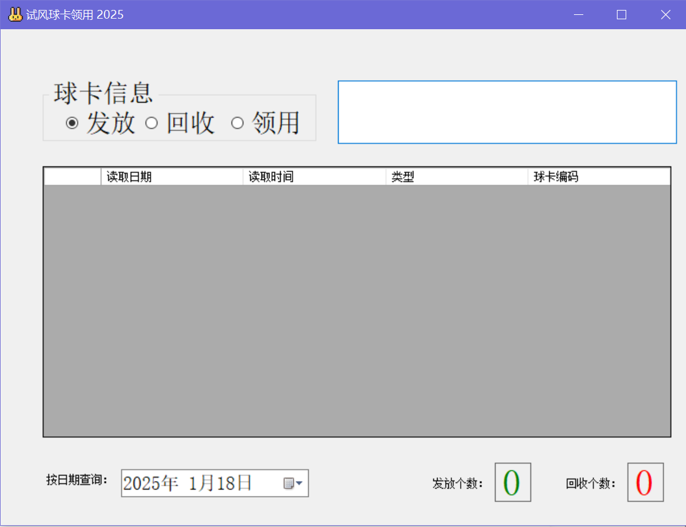

# 使用

球卡使用RFID读卡器。当小球放在上面读取卡号后，会像键盘一样在输入框中输入球卡号，并回车。默认为发放小球。

# 扩展使用

该程序使用SQLite数据库。在程序启动时会检测是否有BallRecords.db，如果没有就会创建一个。如果想删除数据，或者拿数据库做其他分析，可以使用类似于SQLiteStudio之类的软件导出。没有设置密码。

# 开发背景

原JTV使用的是Oracle数据库，不仅操作繁琐，和Oracle数据库服务绑定。迁移时还非常麻烦。本来领用球程序没有太大的数据量，即使用20年，SQLite也完全能够满足。遂重写此程序。

# 鸣谢

本程序全部代码均由ChatGPT和Copilot生成和调试。

程序界面：